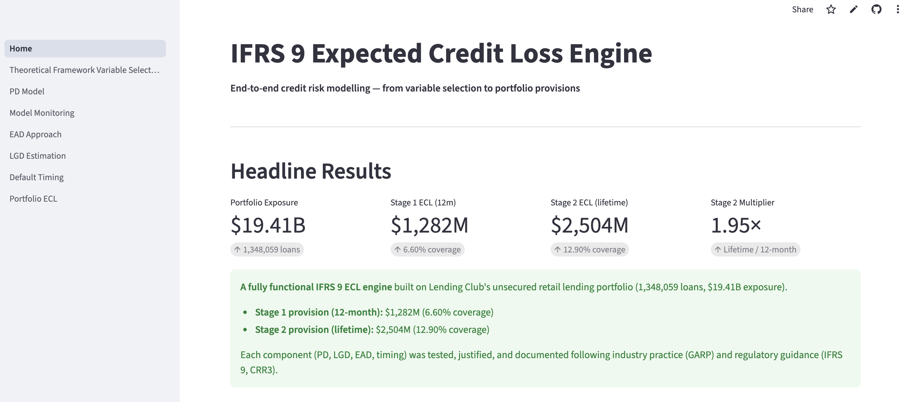

# IFRS 9 Lifetime ECL Engine

**A full credit risk model built on 2.2 million LendingClub loans — PD scorecard, LGD, EAD, and IFRS 9 provisions in one interactive app.** Every modelling decision is justified with data, benchmarked against alternatives, and documented following industry practice (GARP, CRR3, IFRS 9).

[](https://ifrs9-ecl-an.streamlit.app/)



---

## Results at a glance

| Component | Method | Outcome |
|---|---|---|
| **PD** | Logistic regression + WoE scorecard | Gini **0.40** out-of-time, PSI 0.046 (stable) |
| **LGD** | Portfolio constant vs Beta regression | Constant **beats** 2-stage model (MAE 0.036) |
| **EAD** | Amortisation schedule vs OLS | OLS fails out-of-time (R² < 0); amortisation is exact |
| **ECL** | Σ PD_t × LGD × EAD_t | Stage 1: **$1.28B** · Stage 2: **$2.50B** |

---

## Seven pages, one story

| Page | What you'll see |
|---|---|
| **1 · Variable Selection** | 5C framework, WoE binning, IV screening across 19 candidates |
| **2 · PD Model** | Scorecard estimation, ROC curves, live PD simulator |
| **3 · Model Monitoring** | PSI on 2019 Q1 data, score stability, out-of-time validation |
| **4 · EAD** | Why amortisation beats OLS — benchmarked and explained |
| **5 · LGD** | Beta regression vs portfolio constant — head-to-head with data |
| **6 · Default Timing** | Kaplan-Meier timing curves + individual loan ECL calculator |
| **7 · Portfolio ECL** | Stage 1/2 provisions by grade and term, stress scenario simulator |

---

## Run locally

```bash
git clone https://github.com/AnNguyen37/ifrs9-ecl-app.git
cd ifrs9-ecl-app
pip install -r requirements.txt
streamlit run Home.py
```

Data source: [LendingClub 2007–2018 Q4](https://www.kaggle.com/datasets/wordsforthewise/lending-club) (public, not included). Pre-processed model artefacts are in `data/`.

---

## Contact

**An Nguyen** · ngth.hoai.an@gmail.com
